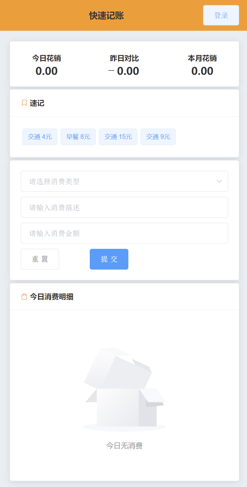
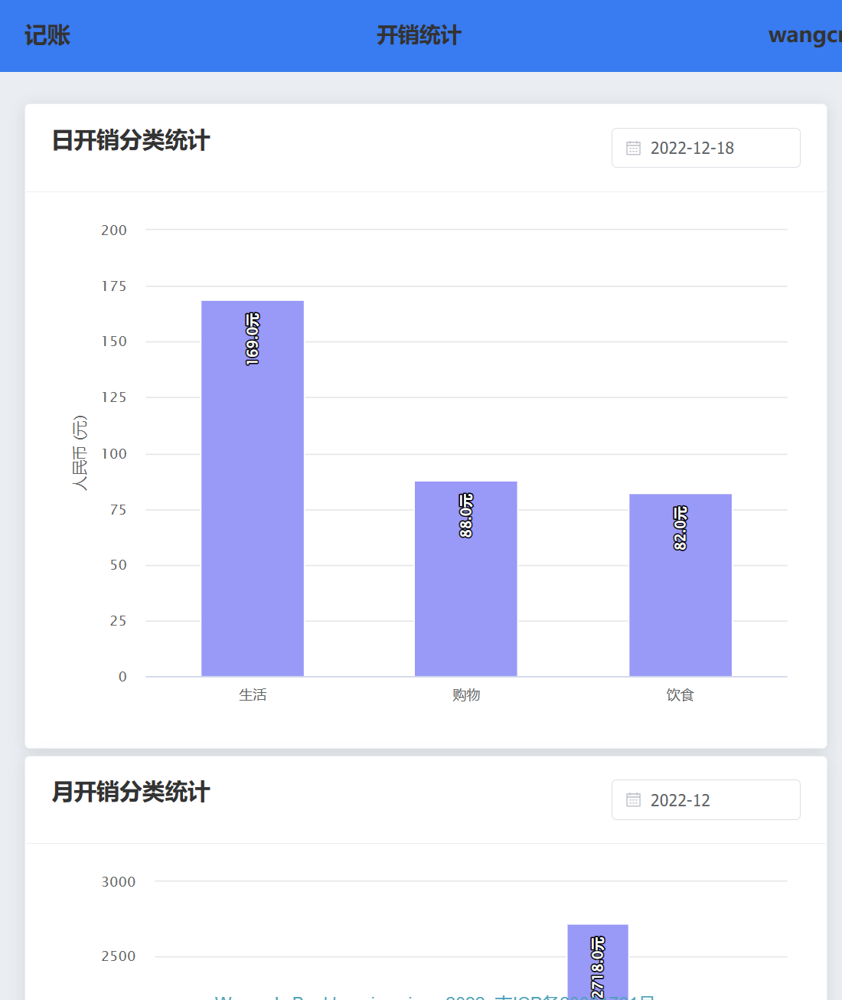
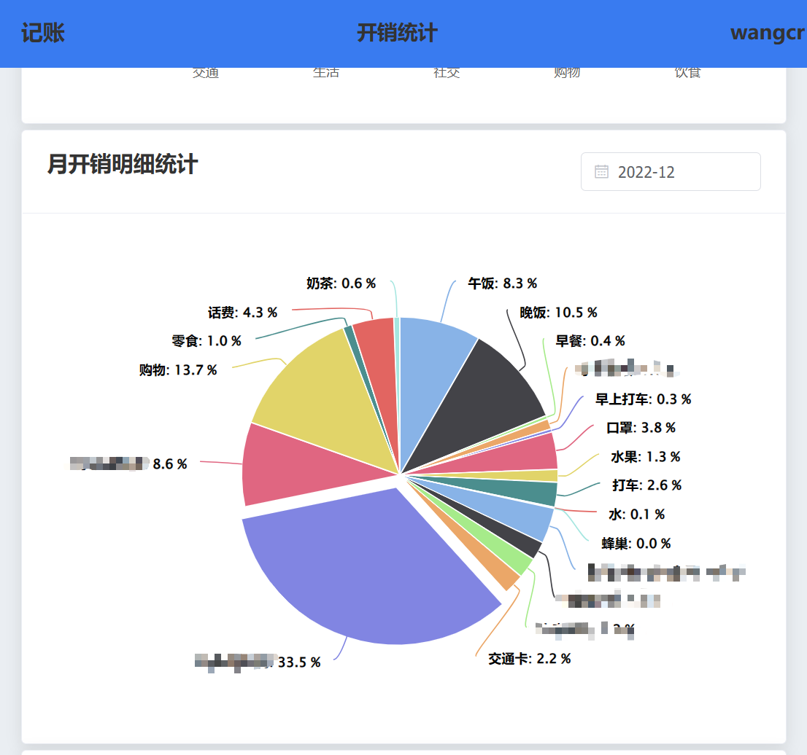

# 快速记账
架构

	- ui ： vue2 + element-ui
	- server：python

## 说明

本项目利用vue+python实现个人快速记账功能，该项目只包含基础的功能，如果需要更高级的要求可以自行修改，前端使用Nginx部署，后端直接脚本启动，数据库使用Mysql数据库，初始化脚本以内置到项目中。



新增统计报表功能






## 功能说明

### 花销统计

登陆后会加载当前用户的花销统计，本日的花销总额，与昨日的花销对比，以及本月的花销情况，这些指标可以自行修改计算。

### 速记

由于日常有一些规律性的花销比如坐地铁，公交，吃饭等等，为了快速计算重复的花销，加入了标签快速记账功能，点击标签即可记账。目前在前端写死标签列表，可扩展读取数据库。

### 记账

记账功能，提供消费类型，消费描述，金额的输入，来对花销进行记账，消费类型前端内置，可扩展到数据库。

### 今日消费明细

在这个功能中可以看到今日所记录的消费情况，按照记账时间倒叙排列

## 配置文件

- nginx 代理

```
upstream bkserver {
    server 127.0.0.1:9988;
}

server {

    listen       8081;
    server_name  localhost;


  location / {
      root /media/bookkeeping;
      index  index.html index.htm;
    }
  location /ylbk {
    proxy_pass http://bkserver/ylbk ;
  }
}
```

## 细节注意

- 本项目采用后端处理跨域
- 本项目的账号权限体系很简单，如果正式使用需要改造


[python 学习](https://www.cnblogs.com/zhxwind/p/11202629.html)
